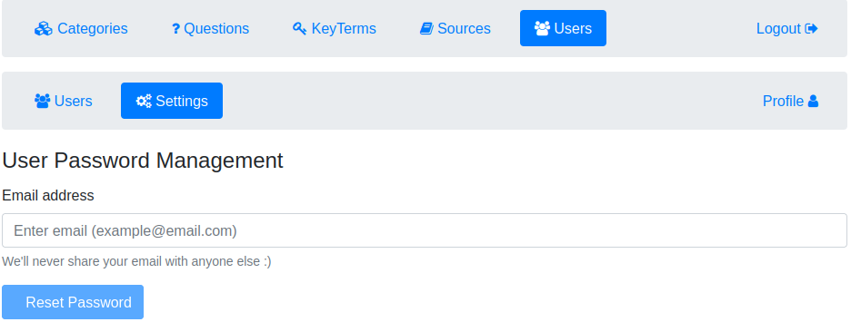

# Knowthenix-ang

This project was generated with [Angular CLI](https://github.com/angular/angular-cli) version 13.0.4.

## Angular frontend for Knowthenix project
Backend: [Knowthenix](https://github.com/dpopkov/knowthenix)

## Development server

* Run `ng serve` for a dev server using Backend.
* Or run `ng serve -c local` for a local server using temporary in-memory datasource.  
* Navigate to `http://localhost:4200/`. The app will automatically reload if you change any of the source files.

## Build

Run `ng build` to build the project. The build artifacts will be stored in the `dist/` directory.

### Screenshots

|  |  |
| ------------- | ------------- |
|  |  |
| Registration page. If password is not provided, it will be generated. | Login page. Number of login attempts is limited, then user is locked. |
|  |  |
| List of all users. | Resetting user password. | 
|  |  |
| Edit user. | Profile of current user. |

The rest of screenshots for categories, questions, keyterms and sources will be added later.
